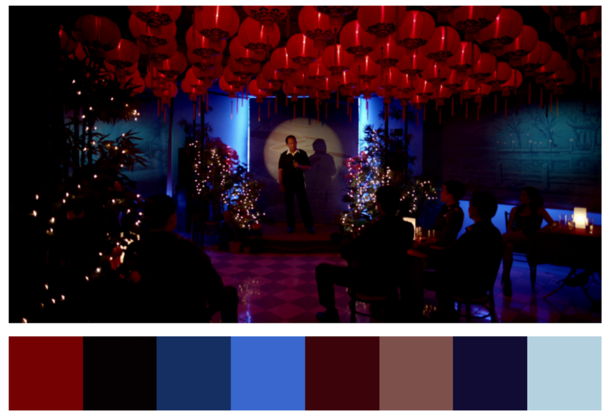
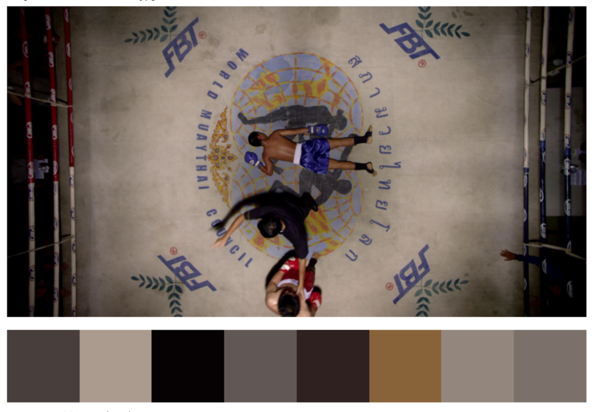

# Color Palettes in Movies



[](https://mybinder.org/v2/gh/a-poor/color-palettes/main?filepath=color-palettes.ipynb)

_by Austin Poor_

Using clustering algorithms to create color palettes from movie stills.

## Running the Notebook

You can run the notebook using binder, [here](https://mybinder.org/v2/gh/a-poor/color-palettes/main?filepath=color-palettes.ipynb).

Or you can download the notebook and run it.

## Explanation

The notebook [color-palettes.ipynb](./color-palettes.ipynb) goes through using both [K-Means](https://scikit-learn.org/stable/modules/generated/sklearn.cluster.KMeans.html) and [Agglomerative](https://scikit-learn.org/stable/modules/generated/sklearn.cluster.AgglomerativeClustering.html) clustering to create color palettes from images.

The sample images come from the film [Only God Forgives (2013)](https://en.wikipedia.org/wiki/Only_God_Forgives) and the stills came from the site [FILMGRAB](https://film-grab.com/2014/01/14/only-god-forgives/).

I chose to use KMeans and Agglomerative clustering for their speed and in order to get a definite color palette size after running the algorithm.

In addition to clustering the images' RGB (red-green-blue) values, I applied the same algorithms on the images' HSV (hue-saturation-value) values.

## Issues



The clustering algorithms tend to pick more commonly occuring colors even if they're similar. 

For example, if you look at the above image, the colors red (from the standing boxer and boxing rope) or blue (from the KO-ed boxer or the mat) seem to stand out, even though they don't take up a lot of the frame.

But the palette generated using K-Means clustering didn't include either and instead picked colors that were more similar and more abundant.

When creating palettes using HSV color representations, both clustering algorithms included a blue but not a red in the palette.

Some possible solutions would be increasing the palette size, adjusting other hyperparameters for the clustering algorithms, or using different clustering algorithms altogether.

## Flask App

In addition to the notebook, I created simple flask-app-API for creating color palettes.

The flask app can be found here: [flask-app/app.py](./flask-app/app.py)

and the color-palette code is in a separate file here: [flask-app/make_palette.py](flask-app/make_palette.py)

With the flask app running, you can make API calls with the following:

```python
import requests

FLASK_URL = "http://localhost:5000"
IMG_URL = "https://film-grab.com/wp-content/uploads/photo-gallery/Colour_Out_of_Space_046.jpg?bwg=1598860186"

response = requests.get(
    FLASK_URL,
    parameters={"url":IMG_URL}
)
print("Color palette:", response.json())
```

The API doesn't include options for picking the clustering algorithm or setting the size of the palette, but those changes should be pretty easy to make.
